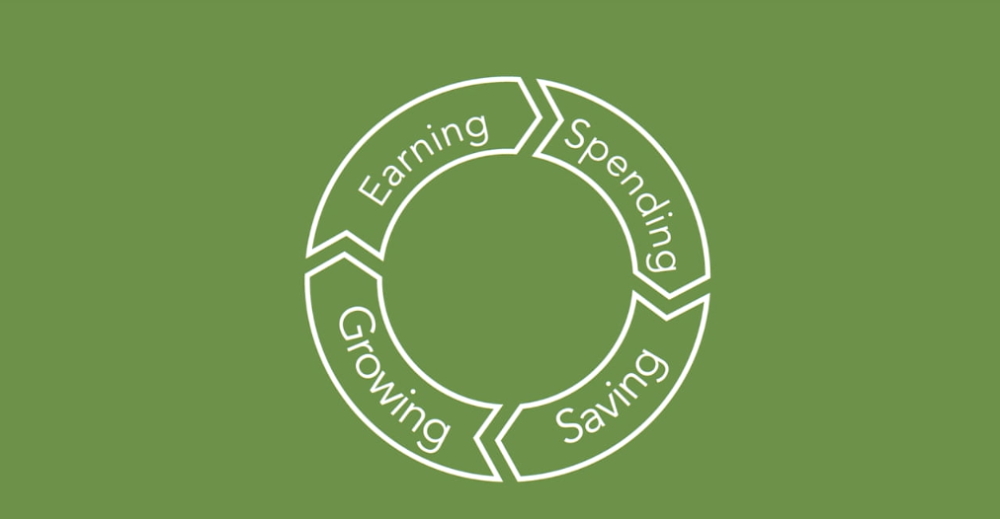
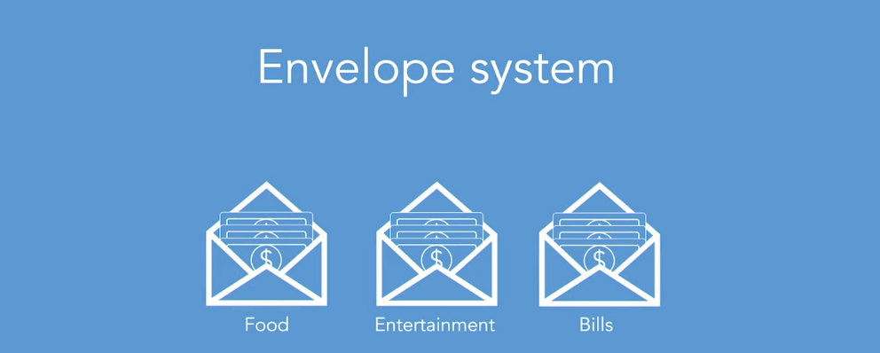

# Managing Your Personal Finances

with Jane Barratt.

### Table of Content:

- **Earning**
  - The Golden Rules of earning more.
  - Different Types of Income
  - Tax and your hard-earned dollars
  - Paying yourself
  - Planning for future earning
  - The Ask
- **Spending**
  - Understand why you spend (sometime too much)
  - Budgeting Tools
  - Planning for windfalls
  - Your creditcard can be your friend, not foe.
- **Saving**
  - Thinking differently about savings
  - where and how to save
  - Your credit score and why it matters
  - Saving vs. debt reduction
- **Investing**
  - Putting your money to work - the options
  - Risk, Value, and Confidence
  - Create your investment strategy
  - DIY vs Outsourcing your money
  - Frees

---

### **Earning**

#### The Golden Rules of earning more.

**Know your worth**

1. Think of your income as a number that grows as you grow.
2. Consider how you spend your time.
3. Follow the money
4. Know your worth

_Your work hard for your money, make it work hard for you_

#### Different Types of Income

**Who pay for You?**

- Companies you work for
- companies you have invested in
- People who buy things from You
- People who pay for Your Time/ Services
- People who rent Things from You.

**Understand, Are you ready to invest ?**
It mean, `Expenses < Income`

**Income**

- Dividends
- Interest

**Equity is the key to long-term financial success**

- Real Estate
- Investment Portfolio
- Business

#### Tax and your hard-earned dollars

#### Paying yourself

#### Planning for future earning

#### The Ask

---

## **Spending**

#### Understand why you spend (sometime too much)

**Earn - Spend = Keep**

_Quotes_

    "Too many people spend the money that they earn to buy things they don't want, to impress people they don't like."

#### Budgeting Tools

Understand how your money flows
Make a Budget (and use Budget Tools)
Track Progress

Budget: **Envelope System**

How to make Budget work for you.?

1. Have a comfortable Budget with room for emergencies or extras.
2. Be conscious of your spending decisions.

(Book: Pound Foolish)

#### Planning for windfalls

#### Your creditcard can be your friend, not foe.

---

## Saving

- Thinking differently about savings
- where and how to save
- Your credit score and why it matters
- Saving vs. debt reduction

---

## Investing

- Putting your money to work - the options
- Risk, Value, and Confidence
- Create your investment strategy
- DIY vs Outsourcing your money
- Frees
